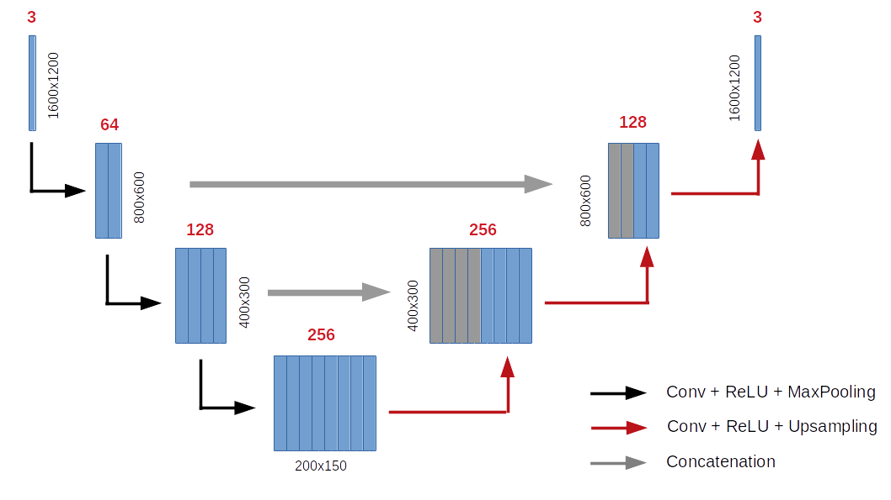
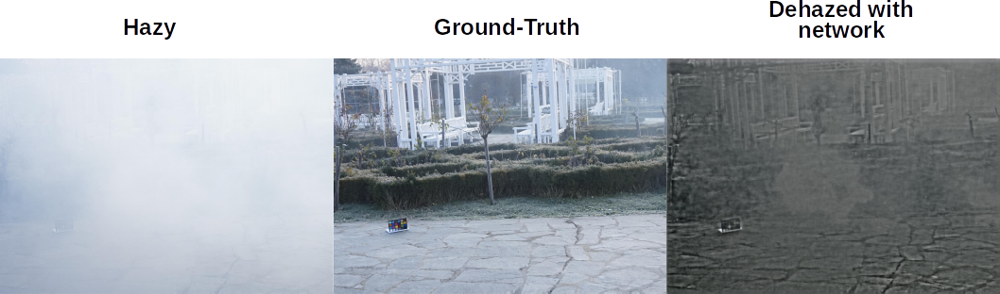
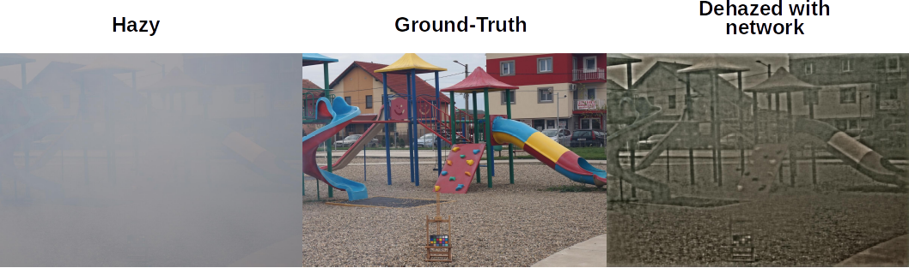
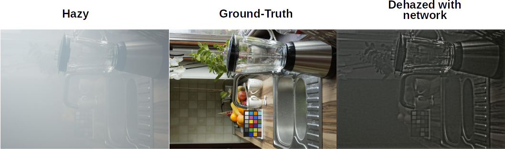

# Neural networks for image dehazing.

We implement in this notebook a simple U-net convolutional network for image dehazing with PyTorch.
It has been developed during an academical project at the Institut d'Optique Graduate School (Palaiseau, France) and is based
on the NTIRE 2019 challenge for the hazy and ground-truth (clear) image sets.

**Network architecture:**

The network architecture is depicted on the figure below and consists in two steps:

- Contracting path: the hazy RGB images (1600x1200) pass through several 3x3 convolutional layers of increasing depths and are
downsampled to extract contextual information.

- Expanding path: 3x3 convolutional layers of decreasing depths and upsampling. The contextual information (output of the first
layers) is directly used in this process to improve the dehazing. The output images have the same size as the inputs.

**Optimization process:**

The network is trained to maximize the [Structural Similarity index](http://www.cns.nyu.edu/pub/lcv/wang03-reprint.pdf) (SSIM),
which is a more accurate measure of the visual similarity of two images than the Mean Squared Error.
The optimization is performed with an ADAM optimizer, batches of 3 images and 100 iterations over the whole training set.

After training, the averaged MSE / SSIM on the train and test sets are similar:
**Avg SSIM = 0.53 and Avg MSE = 0.036 (PSNR = 14.4).**

**Visual evaluation of the dehazing:**

Here are some examples of hazy, Ground-Truth and dehazed images using our network.

